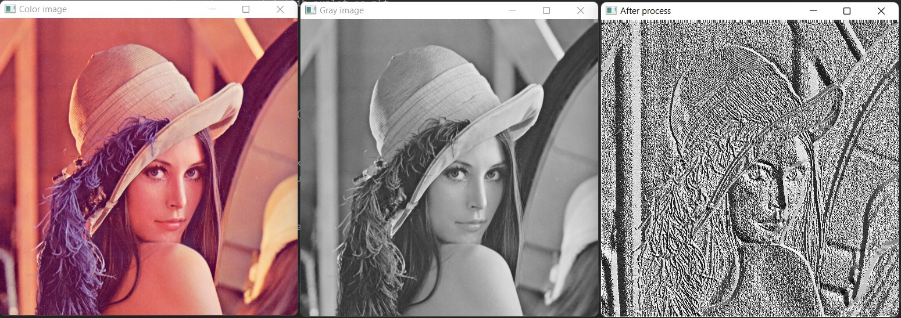

# Convert_IMG_to_LBP_image

### Download library
- pip install opencv-python
- pip install matplotlib
- pip install numpy

## The result after process
<table>
<tr>
  <td width="100%"></td>
</tr>
<table>
